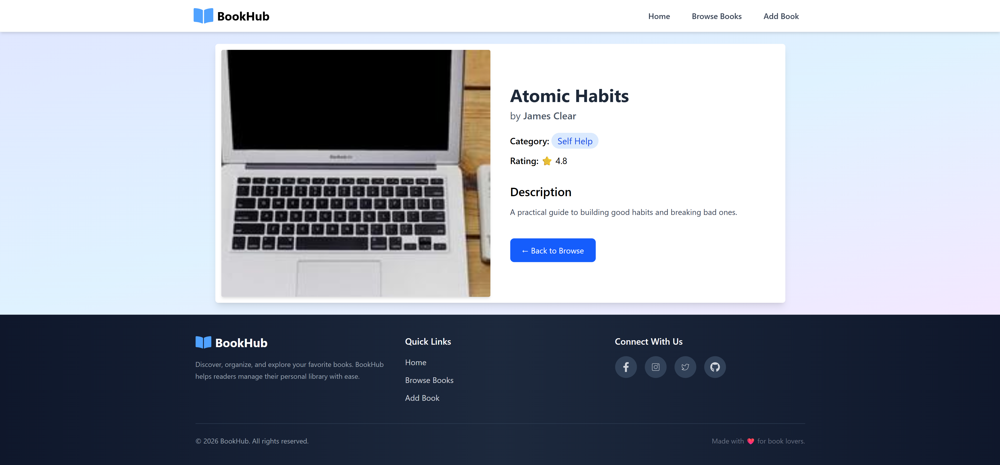
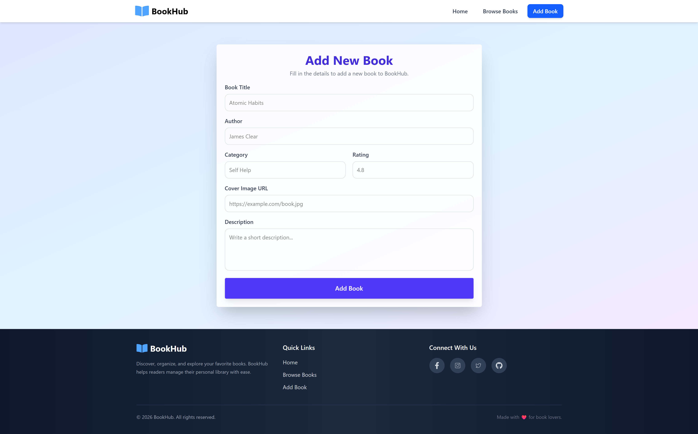

#  BookHub

A modern and responsive **Book Management** web application built with **React**, **Redux Toolkit**, **React Router**, and **Tailwind CSS**.

BookHub allows users to browse books, filter by categories, search for books, add new books, and view detailed information in a clean and intuitive interface.

##  GitHub Repository

Repository: [Bookhub](https://github.com/siddhantsaigaonkar/bookhub-library)

---

##  Features

* Browse all available books
* Search books by title
* Filter books by category
* Add new books
* View detailed information for each book
* State management using Redux Toolkit
* Client-side routing with React Router
* Fully responsive UI
* Modern design with Tailwind CSS

---

## Tech Stack

* **React**
* **Redux Toolkit**
* **React Router DOM**
* **Tailwind CSS**
* **Vite**
* **Swiper.js**

---

## 🚀 How to Run the Application

### Prerequisites

Make sure you have the following installed:

- Node.js (v18 or later recommended)
- npm

### Installation

1. Clone the repository:

```bash
git clone https://github.com/siddhantsaigaonkar/bookhub-library.git
```

2. Navigate to the project directory:

```bash
cd bookhub-library
```

3. Install the dependencies:

```bash
npm install
```

4. Start the development server:

```bash
npm run dev
```

5. Open your browser and visit:

```
http://localhost:5173
```

### Build for Production

```bash
npm run build
```


---

##  Pages

*   Home
*  Browse Books
*  Add Book
*  Book Details
*  Not Found

---


---

## 📸 Screenshots

### Home Page


### Browse Books


### Book Details



### Add Book




---

##  Learning Outcomes

This project demonstrates:

* React Functional Components
* React Hooks
* Redux Toolkit
* React Router
* Component Reusability
* Responsive Design
* State Management
* Modern UI Development

---

##  Author

**Siddhant Saigaonkar**

GitHub: https://github.com/siddhantsaigaonkar

